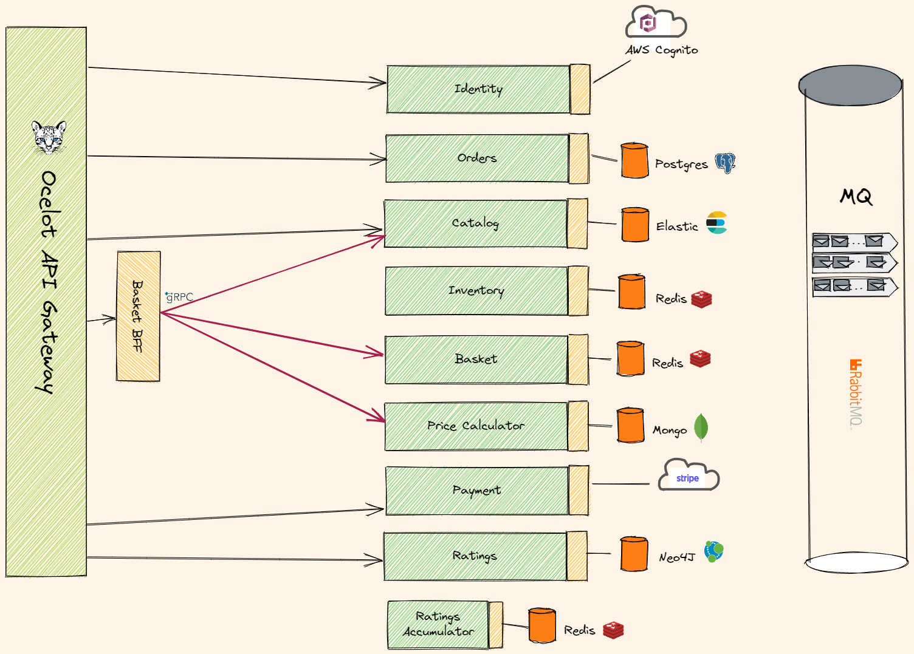

# Booktown microservice project

## Introduction

Microservices are becoming a new trend, thanks to the modularity and granularity they provide on top of advantages like releasing applications in a continuous manner.
There are tons of information, courses, great YouTube videos which aim to make writing and managing microservices easy.

But the acquired knowledge is not always possible to apply to your current job.

Keeping that in mind, I thought, why not make a demo application that can give an example of how microservices are built and how they interact, implement best practices and architecture patterns.

## General overview

What domain should we choose? Popular TODO list service is too trivial. CRUD service is not an option also :unamused:
Well, eCommerce application is something everyone understands. There are several well-defined services and entities in this domain.

Yet another book store is what we need. :smiley:

Ok, let us try to implement `clean architecture`.
We can play with

- [Orders]()
- [Catalog]()
- [Basket]()
- [Shipment]()
- [Recommendations]()
- [Inventory](Src/Services/Inventory/README.md)
- [Identity service](Src/Services/Identity/README.md)

and everything you can think of!

Also we can use the most suitable persistent storages for each service **Relational databases** and **NoSQL**.

- `Postgres`
- `Redis`
- `Mongo`
- `Elastic Search`
- `Cassandra`

you name it!

For asynchronous communications with Service bus we'll leverage `CQRS` pattern with using `MediatR`, `FluentValidation` and `AutoMapper` packages and choose `Masstransit` with `RabbitMQ` as one of the most popular open source message brokers.

We'll put an [API Gateway](Src/APIGateway/README.md) based on `Ocelot API Gateway` in front of our app, to protect inner network.
Though it is not absolutely necessary we will create `BFF` aggregator with sync service communication with the purpose - get our hands dirty on `gRPC` :)

Also we need to add some monitoring and observability to our system - `Logging`, `Metrics`, `Traces`, `Healthchecks`.

We all love dashboards

Since there are lots of moving parts, we need to orchestrate the whole process. `Saga pattern` is also a hot topic nowadays.

Unit and Integration testing is a mandatory requirement. `xUnit` is a right tool for it.

Some `CI/CD` tools would also be appropriate.

All microservices should be containerized it goes without saying. So we'll create `Docker` images
Also app can be run locally using docker-compose, and also deployed to a local `Kubernetes` cluster.

`C# ASP.NET Core 6` is our weapon of choice.

The only thing we'll not create is a frontend application or mobile app.
Well I'm a backend developer. So I'll concentrate on my trade.
But if you want to help me with user app - feel free to send me your ideas.

## Architectural overview

This application is cross-platform at the server side, thanks to .NET 6 services capable of running on Linux or Windows containers depending on your `Docker` host.
The architecture proposes a microservice oriented architecture implementation with multiple autonomous microservices (each one owning its own data/DB) and implementing different approaches within each
microservice (simple CRUD vs. DDD/CQRS patterns) using HTTP as the communication protocol between the client apps and the microservices and supports asynchronous communication for data
updates propagation across multiple services based on Integration Events and a Masstransit Event Bus (a light message broker, to choose between RabbitMQ or Kafka, underneath) plus other
features defined at the roadmap.

It is not a production-ready project but rather showcase of architectural patterns and technologies.
But I think it might be helpful for education purposes.
If you have ideas how to improve project, please share them with me.
