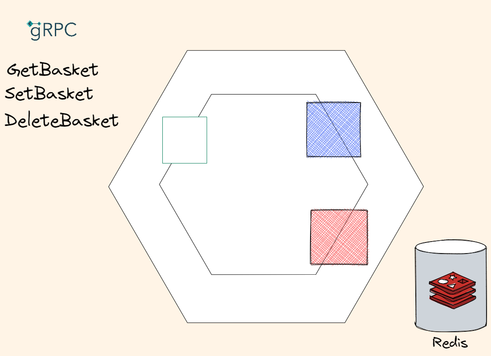

# Basket service

This is a very simple service - we need to store and retrieve user basket from database fast. 

Very fast.

So we'll use `Redis` as a storage and `protobuf` Serializing instead of JSON Serializing/Deserializing.



The whole purpose of using protocol buffers is to serialize your data so that it can be parsed elsewhere. Every generated class has a `WriteTo(CodedOutputStream)` method, where `CodedOutputStream` is a class in the protocol buffer runtime library.

```csharp
    private byte[] ProtoToByteArray(IMessage message)
    {
        int size = message.CalculateSize();
        byte[] buffer = new byte[size];
        CodedOutputStream output = new CodedOutputStream(buffer);
        message.WriteTo(output);
        return buffer;
    }
```

Parsing is also simple. Each generated class has a static Parser property which returns a `MessageParser<T>` for that type. That in turn has methods to parse streams, byte arrays and ByteStrings.

```csharp
        var data = await _database.StringGetAsync(key);

        var basket = UserBasket.Parser.ParseFrom (data);
```

You can find performance and memory footprint comparisons here [Protobuf In C# .NET Part 4 Performance Comparisons](https://dotnetcoretutorials.com/2022/01/18/protobuf-in-c-net-part-4-performance-comparisons/)

## gRPC Calls

- GetBasket (from BFF)
- SetBasket (from BFF)
- DeleteBasket (from BFF)

## Persistent storage

Since we need to store very simple key-value pairs - `Redis` is all we need here.
