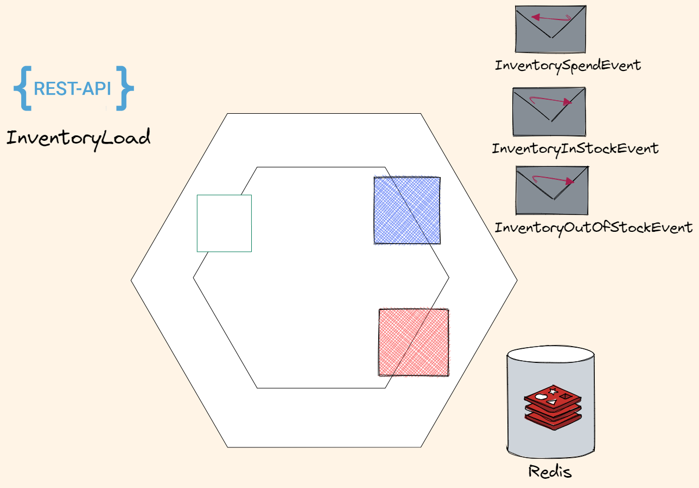

# Inventory service

This is a very simple service - we need to track amount of items in warehouse.
We'll keep it simple - only one warehouse site, no items reservations.

## REST Calls

InventoryLoad (from external source)

## Bus events

### Receive Events

When purchase commited we get `InventorySpendEvent` event (from Saga orchestrator (`Orders service`)) to decrement item quantity

### Send Events

If product now is out of stock - send `InventoryInStockEvent` event to `Catalog service`
If it is a new product or now we have it in stock - send `InventoryOutOfStockEvent` event to `Catalog service`

## Persistent storage

Since we need to store very simple key-value pairs - `Redis` is all we need here

data seeding

make HC

Rabbit settings to config file
C:\Users\Valentin Kolesov\source\repos\Booktown\Src\Infrastructure\MessageBrokers\MessageBrokersExtensions.cs

