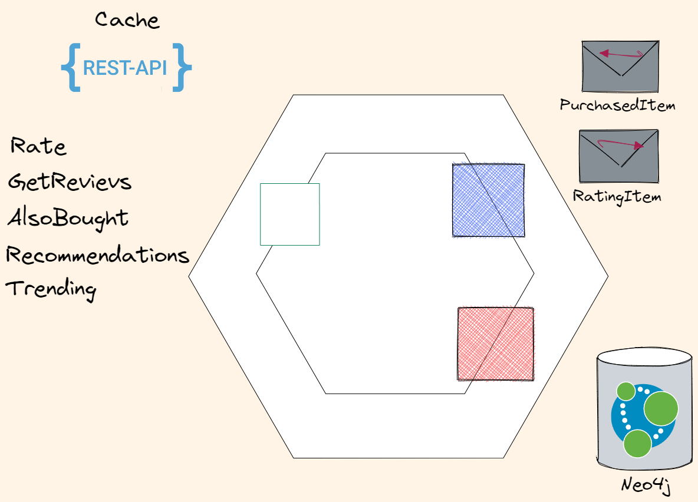

# Ratings service

This is a very interesting service - we need to track all relations between users and books.

This DB is a valuable resource for marketing. 

## REST Calls

Rate

[Cached]
GetReviews
[Cached]
AlsoBought
[Cached]
Trending

[Cached]
[CustomAuthentication]
Recommendations (User)

## Bus events

### Receive Events

When purchase commited we get `PurchaseItemEvent` event (from Saga orchestrator (`Orders service`)) to store Purchase link between user and product.

### Send Events

When product gets a rating - send `RatingItemEvent` event to `RatingAccumulator service`

## Persistent storage

Since we need to store bunch of nodes and links - we need a graph DB. 
Neo4j is an obvious choice.

With this DB we can do amazing things right out of the box - with relatively simple Cypher queries we can build recommendation system based on user individual preferences.
We can implement [Community detection](https://neo4j.com/docs/graph-data-science/current/algorithms/community/) and make special offers for community members.
Identify trenging products or most active reviewers. All this is a gold mine for marketing department!
There are a lot of ideas, but we'll implement only couple of them.

data seeding

User recommendations should be under Auth
Paginate responses

